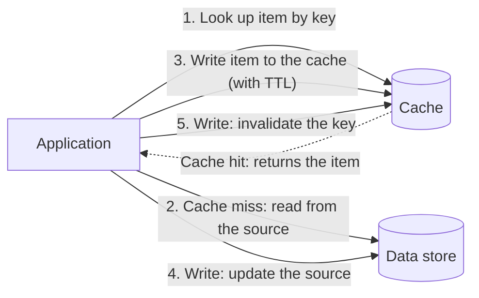

```mermaid
flowchart LR
    App["Application"]
    Cache[("Cache")]
    Store[("Data store")]

    App -->|"1. Look up item by key"| Cache
    Cache -.->|"Cache hit: returns the item"| App
    App -->|"2. Cache miss: read from the source"| Store
    App -->|"3. Write item to the cache (with TTL)"| Cache
    App -->|"4. Write: update the source"| Store
    App -->|"5. Write: invalidate the key"| Cache
```
