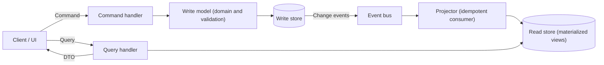

```mermaid
flowchart LR
    U["Client / UI"] -->|"Command"| CH["Command handler"]
    CH --> WM["Write model (domain and validation)"]
    WM --> WS[("Write store")]
    WS -->|"Change events"| EB["Event bus"]
    EB --> PR["Projector (idempotent consumer)"]
    PR --> RS[("Read store (materialized views)")]
    U -->|"Query"| QH["Query handler"]
    QH --> RS
    QH -->|"DTO"| U
```
