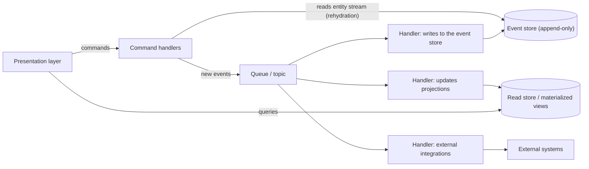

```mermaid
flowchart LR
    UI["Presentation layer"] -- "commands" --> CH["Command handlers"]
    CH -- "reads entity stream (rehydration)" --> ES[("Event store (append-only)")]
    CH -- "new events" --> Q["Queue / topic"]
    Q --> H1["Handler: writes to the event store"]
    H1 --> ES
    Q --> H2["Handler: updates projections"]
    H2 --> RS[("Read store / materialized views")]
    Q --> H3["Handler: external integrations"]
    H3 --> EXT["External systems"]
    UI -- "queries" --> RS
```
