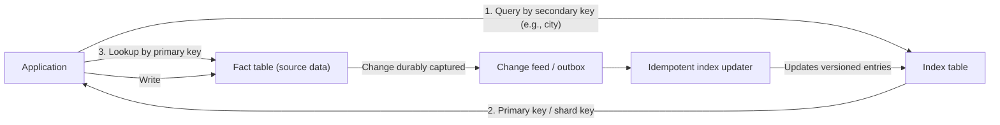

```mermaid
flowchart LR
    App["Application"] -->|"1. Query by secondary key (e.g., city)"| Idx["Index table"]
    Idx -->|"2. Primary key / shard key"| App
    App -->|"3. Lookup by primary key"| Fatos["Fact table (source data)"]
    App -->|"Write"| Fatos
    Fatos -->|"Change durably captured"| Fila["Change feed / outbox"]
    Fila --> Worker["Idempotent index updater"]
    Worker -->|"Updates versioned entries"| Idx
```
