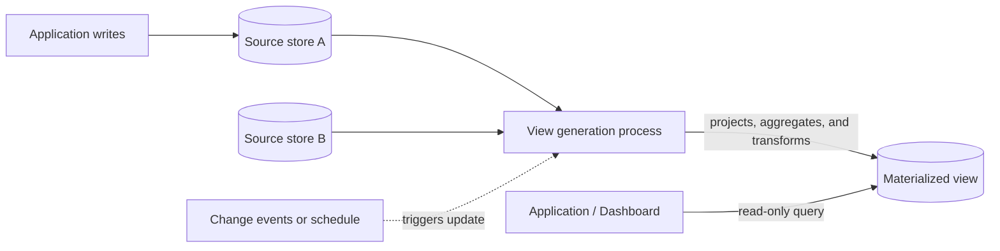

```mermaid
flowchart LR
    S1[("Source store A")] --> G["View generation process"]
    S2[("Source store B")] --> G
    E["Change events or schedule"] -.->|"triggers update"| G
    G -->|"projects, aggregates, and transforms"| V[("Materialized view")]
    App["Application / Dashboard"] -->|"read-only query"| V
    W["Application writes"] --> S1
```
