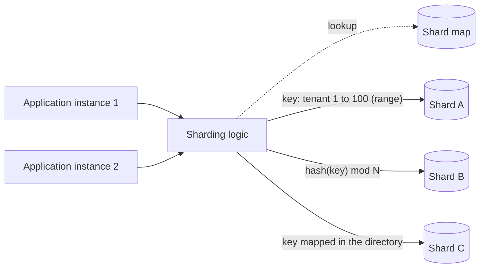

```mermaid
flowchart LR
    App1["Application instance 1"] --> Logic["Sharding logic"]
    App2["Application instance 2"] --> Logic
    Logic -. "lookup" .-> Map[("Shard map")]
    Logic -- "key: tenant 1 to 100 (range)" --> ShardA[("Shard A")]
    Logic -- "hash(key) mod N" --> ShardB[("Shard B")]
    Logic -- "key mapped in the directory" --> ShardC[("Shard C")]
```
