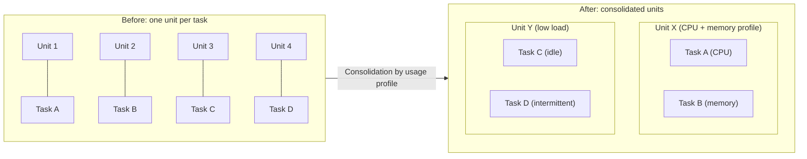

```mermaid
flowchart LR
    subgraph Antes["Before: one unit per task"]
        U1["Unit 1"] --- TA["Task A"]
        U2["Unit 2"] --- TB["Task B"]
        U3["Unit 3"] --- TC["Task C"]
        U4["Unit 4"] --- TD["Task D"]
    end

    subgraph Depois["After: consolidated units"]
        subgraph UX["Unit X (CPU + memory profile)"]
            XA["Task A (CPU)"]
            XB["Task B (memory)"]
        end
        subgraph UY["Unit Y (low load)"]
            YC["Task C (idle)"]
            YD["Task D (intermittent)"]
        end
    end

    Antes -- "Consolidation by usage profile" --> Depois
```
