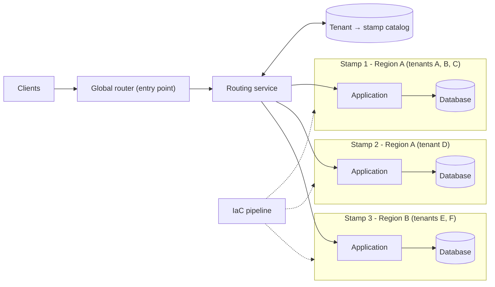

```mermaid
flowchart LR
    U[Clients] --> G["Global router (entry point)"]
    G --> R[Routing service]
    R <--> M[("Tenant → stamp catalog")]
    subgraph S1["Stamp 1 - Region A (tenants A, B, C)"]
        A1[Application] --> D1[(Database)]
    end
    subgraph S2["Stamp 2 - Region A (tenant D)"]
        A2[Application] --> D2[(Database)]
    end
    subgraph S3["Stamp 3 - Region B (tenants E, F)"]
        A3[Application] --> D3[(Database)]
    end
    R --> A1
    R --> A2
    R --> A3
    P["IaC pipeline"] -.-> S1
    P -.-> S2
    P -.-> S3
```
