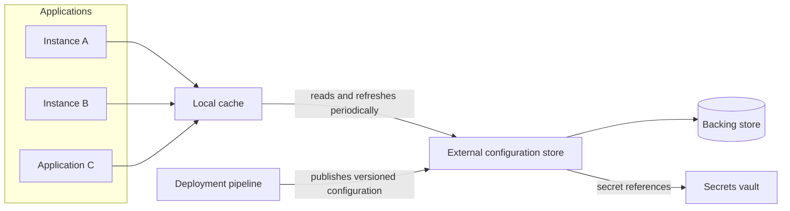

```mermaid
flowchart LR
    subgraph Apps["Applications"]
        A1["Instance A"]
        A2["Instance B"]
        A3["Application C"]
    end
    C["Local cache"]
    S["External configuration store"]
    DB[("Backing store")]
    K["Secrets vault"]
    P["Deployment pipeline"]

    A1 --> C
    A2 --> C
    A3 --> C
    C -- "reads and refreshes periodically" --> S
    S --> DB
    S -- "secret references" --> K
    P -- "publishes versioned configuration" --> S
```
