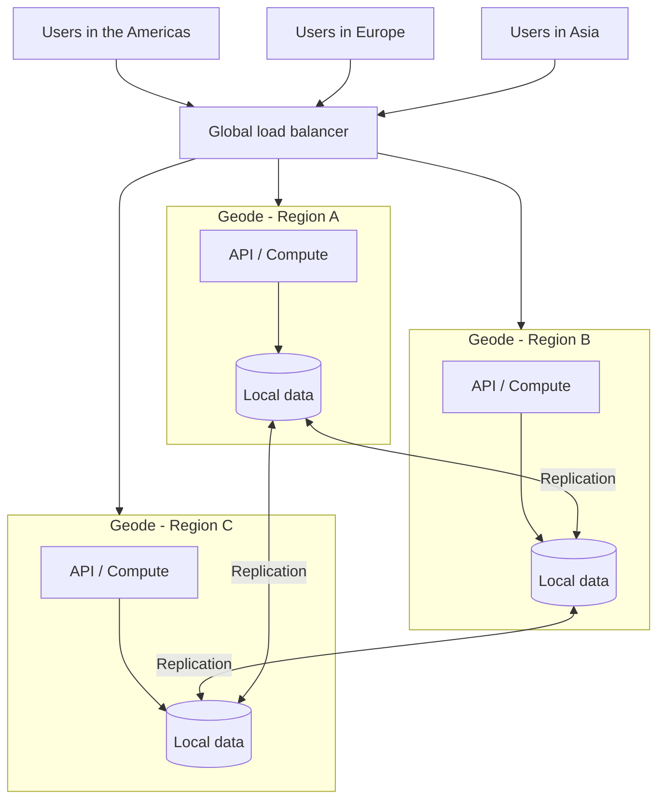

```mermaid
flowchart TB
    U1["Users in the Americas"] --> LB["Global load balancer"]
    U2["Users in Europe"] --> LB
    U3["Users in Asia"] --> LB

    LB --> G1
    LB --> G2
    LB --> G3

    subgraph G1["Geode - Region A"]
        A1["API / Compute"] --> D1[("Local data")]
    end
    subgraph G2["Geode - Region B"]
        A2["API / Compute"] --> D2[("Local data")]
    end
    subgraph G3["Geode - Region C"]
        A3["API / Compute"] --> D3[("Local data")]
    end

    D1 <-->|"Replication"| D2
    D2 <-->|"Replication"| D3
    D1 <-->|"Replication"| D3
```
