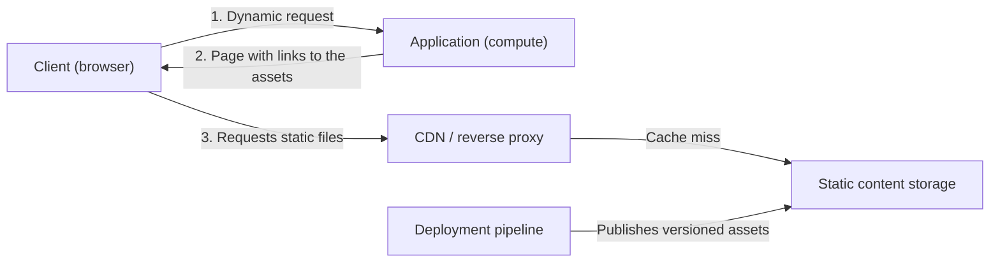

```mermaid
flowchart LR
    C["Client (browser)"]
    A["Application (compute)"]
    CDN["CDN / reverse proxy"]
    S["Static content storage"]
    P["Deployment pipeline"]

    C -->|"1. Dynamic request"| A
    A -->|"2. Page with links to the assets"| C
    C -->|"3. Requests static files"| CDN
    CDN -->|"Cache miss"| S
    P -->|"Publishes versioned assets"| S
```
