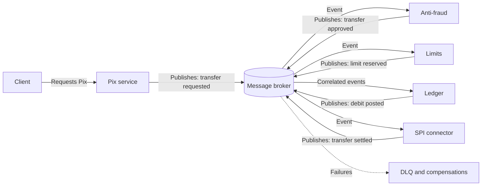

```mermaid
flowchart LR
    C["Client"] -->|"Requests Pix"| I["Pix service"]
    I -->|"Publishes: transfer requested"| B[("Message broker")]
    B -->|"Event"| F["Anti-fraud"]
    B -->|"Event"| LM["Limits"]
    F -->|"Publishes: transfer approved"| B
    LM -->|"Publishes: limit reserved"| B
    B -->|"Correlated events"| L["Ledger"]
    L -->|"Publishes: debit posted"| B
    B -->|"Event"| K["SPI connector"]
    K -->|"Publishes: transfer settled"| B
    B -.->|"Failures"| Q["DLQ and compensations"]
```
