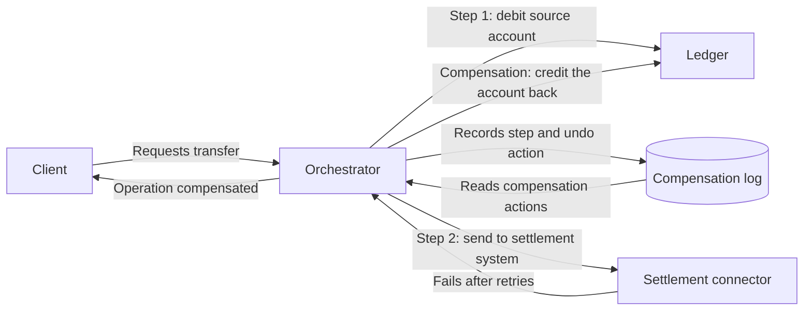

```mermaid
flowchart LR
    C["Client"] -->|"Requests transfer"| O["Orchestrator"]
    O -->|"Step 1: debit source account"| A["Ledger"]
    O -->|"Records step and undo action"| L[("Compensation log")]
    O -->|"Step 2: send to settlement system"| B["Settlement connector"]
    B -->|"Fails after retries"| O
    L -->|"Reads compensation actions"| O
    O -->|"Compensation: credit the account back"| A
    O -->|"Operation compensated"| C
```
