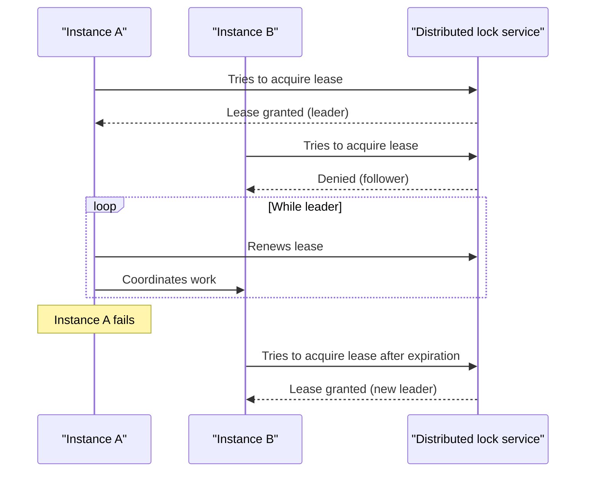

```mermaid
sequenceDiagram
    participant A as "Instance A"
    participant B as "Instance B"
    participant L as "Distributed lock service"
    A->>L: Tries to acquire lease
    L-->>A: Lease granted (leader)
    B->>L: Tries to acquire lease
    L-->>B: Denied (follower)
    loop While leader
        A->>L: Renews lease
        A->>B: Coordinates work
    end
    Note over A: Instance A fails
    B->>L: Tries to acquire lease after expiration
    L-->>B: Lease granted (new leader)
```
