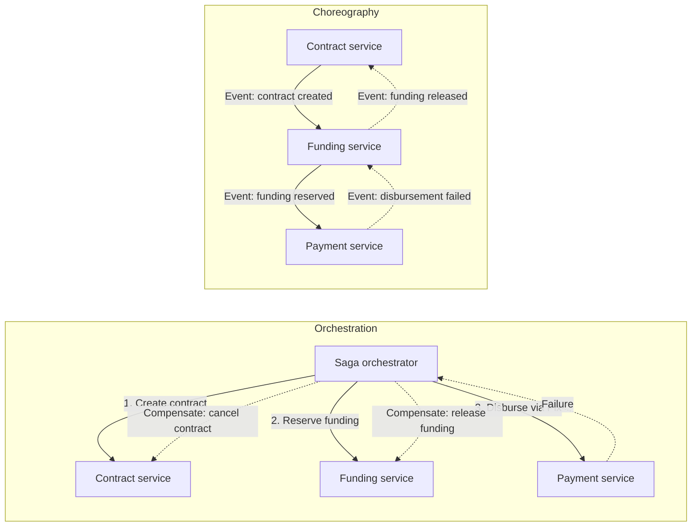

```mermaid
flowchart LR
    subgraph Orquestracao["Orchestration"]
        O["Saga orchestrator"] -->|"1. Create contract"| P1["Contract service"]
        O -->|"2. Reserve funding"| P2["Funding service"]
        O -->|"3. Disburse via Pix"| P3["Payment service"]
        P3 -.->|"Failure"| O
        O -.->|"Compensate: release funding"| P2
        O -.->|"Compensate: cancel contract"| P1
    end

    subgraph Coreografia["Choreography"]
        C1["Contract service"] -->|"Event: contract created"| C2["Funding service"]
        C2 -->|"Event: funding reserved"| C3["Payment service"]
        C3 -.->|"Event: disbursement failed"| C2
        C2 -.->|"Event: funding released"| C1
    end
```
