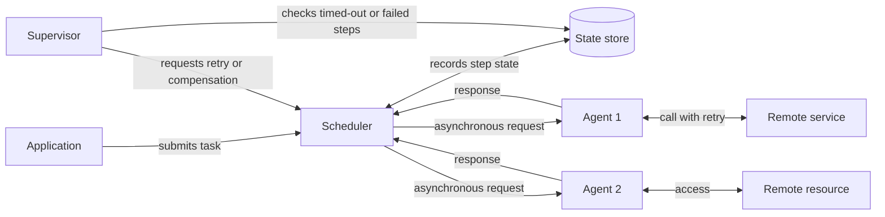

```mermaid
flowchart LR
    App["Application"] -->|"submits task"| S["Scheduler"]
    S <-->|"records step state"| DB[("State store")]
    S -->|"asynchronous request"| A1["Agent 1"]
    S -->|"asynchronous request"| A2["Agent 2"]
    A1 -->|"response"| S
    A2 -->|"response"| S
    A1 <-->|"call with retry"| R1["Remote service"]
    A2 <-->|"access"| R2["Remote resource"]
    SUP["Supervisor"] -->|"checks timed-out or failed steps"| DB
    SUP -->|"requests retry or compensation"| S
```
