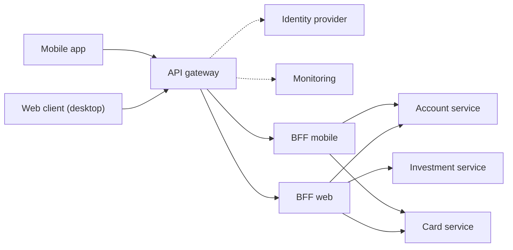

```mermaid
flowchart LR
    W["Web client (desktop)"] --> G["API gateway"]
    M["Mobile app"] --> G
    G -.-> I["Identity provider"]
    G -.-> O["Monitoring"]
    G --> BW["BFF web"]
    G --> BM["BFF mobile"]
    BW --> S1["Account service"]
    BW --> S2["Card service"]
    BM --> S1
    BM --> S2
    BW --> S3["Investment service"]
```
