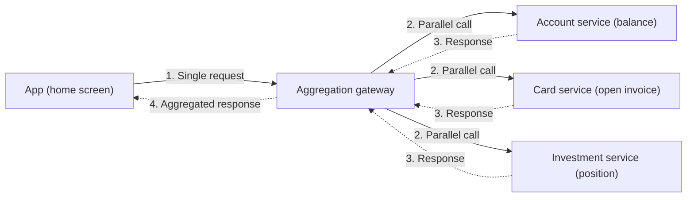

```mermaid
flowchart LR
    C["App (home screen)"] -->|"1. Single request"| G["Aggregation gateway"]
    G -->|"2. Parallel call"| S1["Account service (balance)"]
    G -->|"2. Parallel call"| S2["Card service (open invoice)"]
    G -->|"2. Parallel call"| S3["Investment service (position)"]
    S1 -.->|"3. Response"| G
    S2 -.->|"3. Response"| G
    S3 -.->|"3. Response"| G
    G -.->|"4. Aggregated response"| C
```
