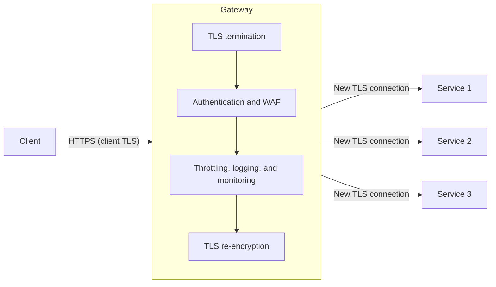

```mermaid
flowchart LR
    C[Client] -- "HTTPS (client TLS)" --> G
    subgraph G["Gateway"]
        direction TB
        T["TLS termination"] --> A["Authentication and WAF"]
        A --> R["Throttling, logging, and monitoring"]
        R --> E["TLS re-encryption"]
    end
    G -- "New TLS connection" --> S1["Service 1"]
    G -- "New TLS connection" --> S2["Service 2"]
    G -- "New TLS connection" --> S3["Service 3"]
```
