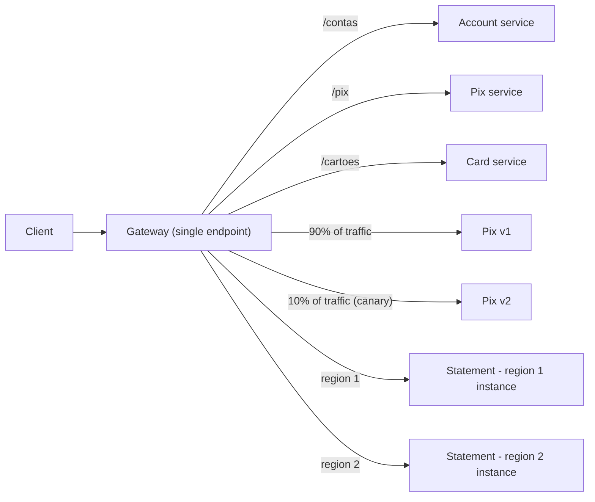

```mermaid
flowchart LR
    C[Client] --> G["Gateway (single endpoint)"]
    G -->|"/contas"| S1[Account service]
    G -->|"/pix"| S2[Pix service]
    G -->|"/cartoes"| S3[Card service]
    G -->|"90% of traffic"| V1["Pix v1"]
    G -->|"10% of traffic (canary)"| V2["Pix v2"]
    G -->|"region 1"| R1["Statement - region 1 instance"]
    G -->|"region 2"| R2["Statement - region 2 instance"]
```
