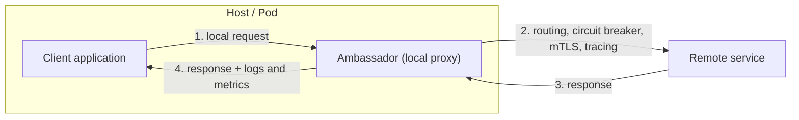

```mermaid
flowchart LR
    subgraph Host["Host / Pod"]
        App["Client application"]
        Amb["Ambassador (local proxy)"]
    end
    Remote["Remote service"]

    App -->|"1. local request"| Amb
    Amb -->|"2. routing, circuit breaker, mTLS, tracing"| Remote
    Remote -->|"3. response"| Amb
    Amb -->|"4. response + logs and metrics"| App
```
