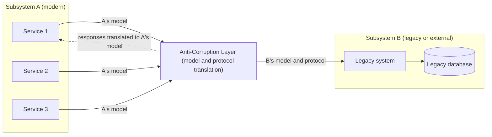

```mermaid
flowchart LR
    subgraph A["Subsystem A (modern)"]
        S1[Service 1]
        S2[Service 2]
        S3[Service 3]
    end
    ACL["Anti-Corruption Layer (model and protocol translation)"]
    subgraph B["Subsystem B (legacy or external)"]
        L[Legacy system]
        DB[(Legacy database)]
    end
    S1 -->|"A's model"| ACL
    S2 -->|"A's model"| ACL
    S3 -->|"A's model"| ACL
    ACL -->|"B's model and protocol"| L
    L --> DB
    ACL -.->|"responses translated to A's model"| S1
```
