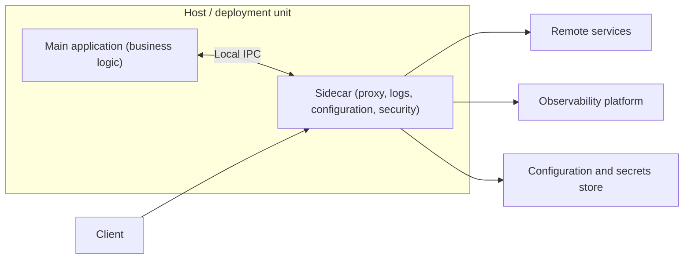

```mermaid
flowchart LR
    C[Client]
    subgraph H["Host / deployment unit"]
        A["Main application (business logic)"]
        S["Sidecar (proxy, logs, configuration, security)"]
        A <-->|"Local IPC"| S
    end
    C --> S
    S --> R["Remote services"]
    S --> M["Observability platform"]
    S --> K["Configuration and secrets store"]
```
