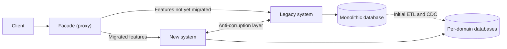

```mermaid
flowchart LR
    C[Client] --> F["Facade (proxy)"]
    F -->|"Features not yet migrated"| L[Legacy system]
    F -->|"Migrated features"| N[New system]
    N <-->|"Anti-corruption layer"| L
    L --> DBL[("Monolithic database")]
    N --> DBN[("Per-domain databases")]
    DBL -.->|"Initial ETL and CDC"| DBN
```
