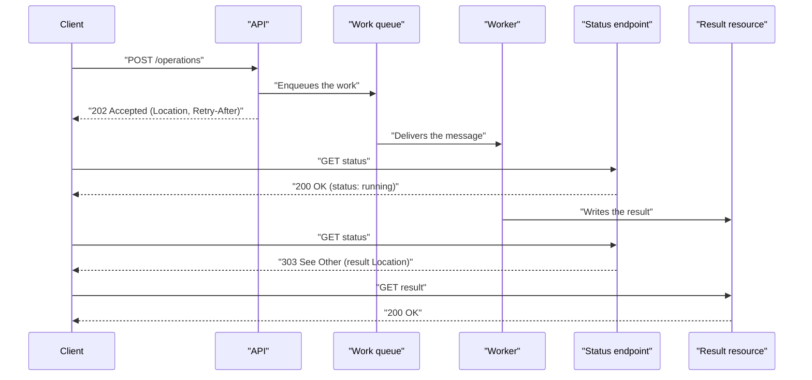

```mermaid
sequenceDiagram
    participant C as Client
    participant A as "API"
    participant Q as "Work queue"
    participant W as "Worker"
    participant S as "Status endpoint"
    participant R as "Result resource"
    C->>A: "POST /operations"
    A->>Q: "Enqueues the work"
    A-->>C: "202 Accepted (Location, Retry-After)"
    Q->>W: "Delivers the message"
    C->>S: "GET status"
    S-->>C: "200 OK (status: running)"
    W->>R: "Writes the result"
    C->>S: "GET status"
    S-->>C: "303 See Other (result Location)"
    C->>R: "GET result"
    R-->>C: "200 OK"
```
