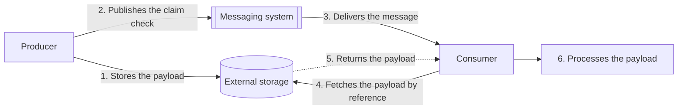

```mermaid
flowchart LR
    P[Producer] -->|"1. Stores the payload"| S[("External storage")]
    P -->|"2. Publishes the claim check"| M[["Messaging system"]]
    M -->|"3. Delivers the message"| C[Consumer]
    C -->|"4. Fetches the payload by reference"| S
    S -.->|"5. Returns the payload"| C
    C --> R["6. Processes the payload"]
```
