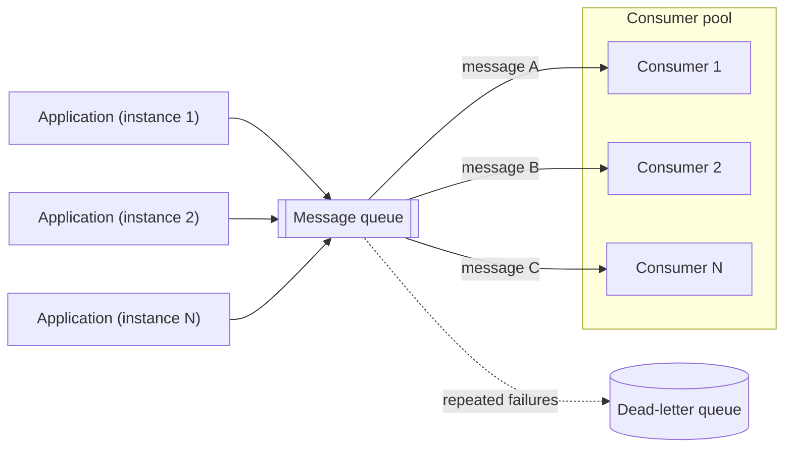

```mermaid
flowchart LR
    P1["Application (instance 1)"] --> Q[["Message queue"]]
    P2["Application (instance 2)"] --> Q
    P3["Application (instance N)"] --> Q
    subgraph Pool["Consumer pool"]
        C1["Consumer 1"]
        C2["Consumer 2"]
        C3["Consumer N"]
    end
    Q -->|"message A"| C1
    Q -->|"message B"| C2
    Q -->|"message C"| C3
    Q -.->|"repeated failures"| DLQ[("Dead-letter queue")]
```
