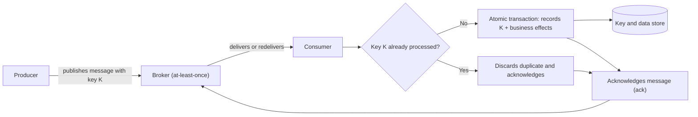

```mermaid
flowchart LR
    P["Producer"] -->|"publishes message with key K"| B["Broker (at-least-once)"]
    B -->|"delivers or redelivers"| C["Consumer"]
    C --> D{"Key K already processed?"}
    D -->|"No"| T["Atomic transaction: records K + business effects"]
    T --> S[("Key and data store")]
    T --> A["Acknowledges message (ack)"]
    D -->|"Yes"| X["Discards duplicate and acknowledges"]
    X --> A
    A --> B
```
