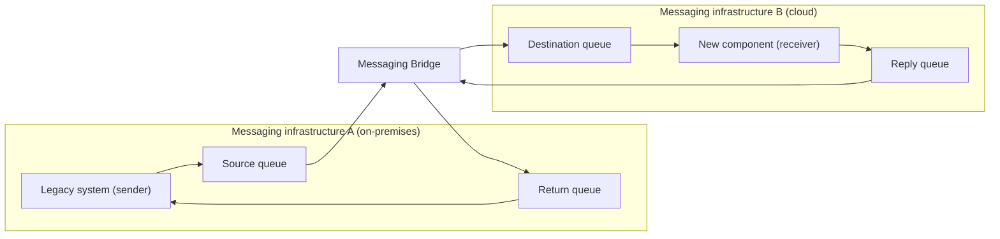

```mermaid
flowchart LR
    subgraph A["Messaging infrastructure A (on-premises)"]
        S["Legacy system (sender)"] --> QA["Source queue"]
        QA2["Return queue"] --> S
    end
    subgraph B["Messaging infrastructure B (cloud)"]
        QB["Destination queue"] --> R["New component (receiver)"]
        R --> QB2["Reply queue"]
    end
    QA --> BR["Messaging Bridge"]
    BR --> QB
    QB2 --> BR
    BR --> QA2
```
