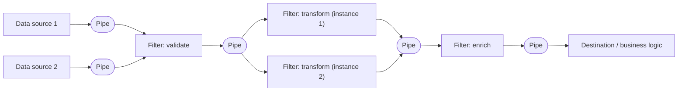

```mermaid
flowchart LR
    S1["Data source 1"] --> P1(["Pipe"])
    S2["Data source 2"] --> P2(["Pipe"])
    P1 --> F1["Filter: validate"]
    P2 --> F1
    F1 --> P3(["Pipe"])
    P3 --> F2a["Filter: transform (instance 1)"]
    P3 --> F2b["Filter: transform (instance 2)"]
    F2a --> P4(["Pipe"])
    F2b --> P4
    P4 --> F3["Filter: enrich"]
    F3 --> P5(["Pipe"])
    P5 --> D["Destination / business logic"]
```
