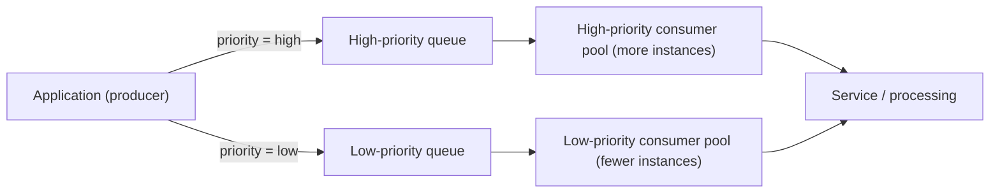

```mermaid
flowchart LR
    P["Application (producer)"] -->|"priority = high"| QA["High-priority queue"]
    P -->|"priority = low"| QB["Low-priority queue"]
    QA --> CA["High-priority consumer pool (more instances)"]
    QB --> CB["Low-priority consumer pool (fewer instances)"]
    CA --> S["Service / processing"]
    CB --> S
```
