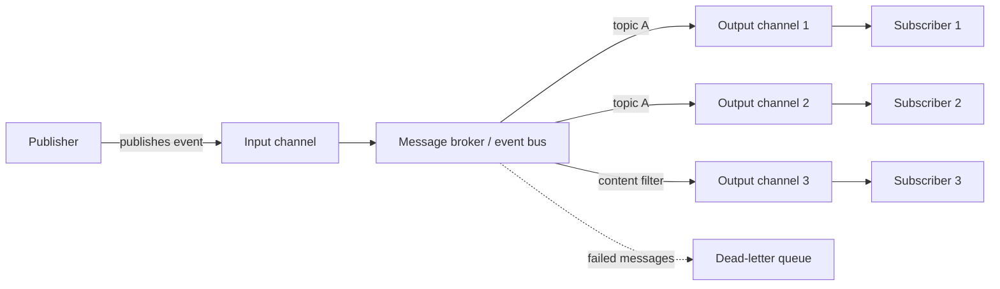

```mermaid
flowchart LR
    P["Publisher"] -->|"publishes event"| IN["Input channel"]
    IN --> B["Message broker / event bus"]
    B -->|"topic A"| O1["Output channel 1"]
    B -->|"topic A"| O2["Output channel 2"]
    B -->|"content filter"| O3["Output channel 3"]
    O1 --> S1["Subscriber 1"]
    O2 --> S2["Subscriber 2"]
    O3 --> S3["Subscriber 3"]
    B -.->|"failed messages"| DLQ["Dead-letter queue"]
```
