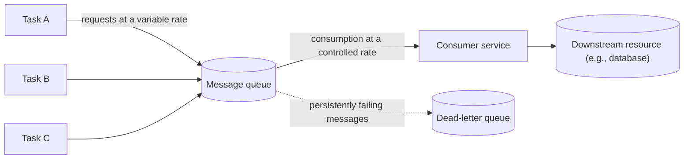

```mermaid
flowchart LR
    T1["Task A"] -- "requests at a variable rate" --> Q[("Message queue")]
    T2["Task B"] --> Q
    T3["Task C"] --> Q
    Q -- "consumption at a controlled rate" --> S["Consumer service"]
    S --> D[("Downstream resource (e.g., database)")]
    Q -. "persistently failing messages" .-> DLQ[("Dead-letter queue")]
```
