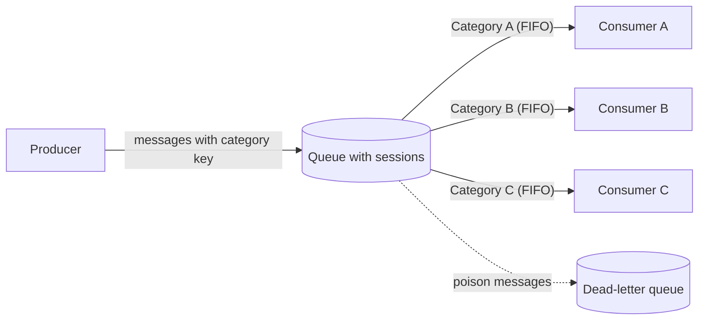

```mermaid
flowchart LR
    P[Producer] -->|"messages with category key"| Q[("Queue with sessions")]
    Q -->|"Category A (FIFO)"| CA[Consumer A]
    Q -->|"Category B (FIFO)"| CB[Consumer B]
    Q -->|"Category C (FIFO)"| CC[Consumer C]
    Q -.->|"poison messages"| DLQ[("Dead-letter queue")]
```
