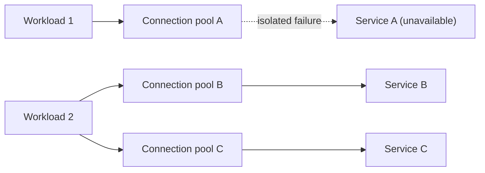

```mermaid
flowchart LR
    W1["Workload 1"] --> PA["Connection pool A"]
    W2["Workload 2"] --> PB["Connection pool B"]
    W2 --> PC["Connection pool C"]
    PA -. "isolated failure" .-> SA["Service A (unavailable)"]
    PB --> SB["Service B"]
    PC --> SC["Service C"]
```
