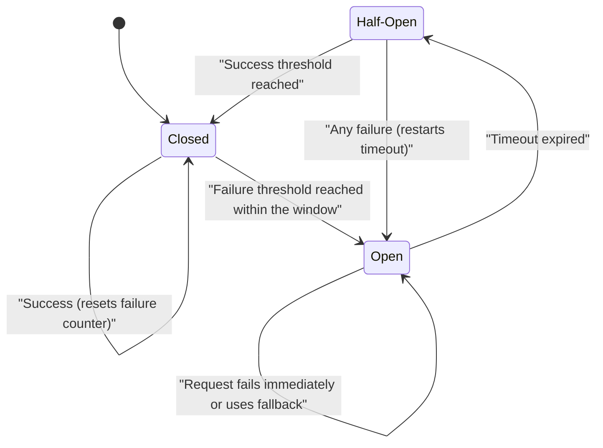

```mermaid
stateDiagram-v2
    state "Half-Open" as HalfOpen
    [*] --> Closed
    Closed --> Closed: "Success (resets failure counter)"
    Closed --> Open: "Failure threshold reached within the window"
    Open --> Open: "Request fails immediately or uses fallback"
    Open --> HalfOpen: "Timeout expired"
    HalfOpen --> Closed: "Success threshold reached"
    HalfOpen --> Open: "Any failure (restarts timeout)"
```
