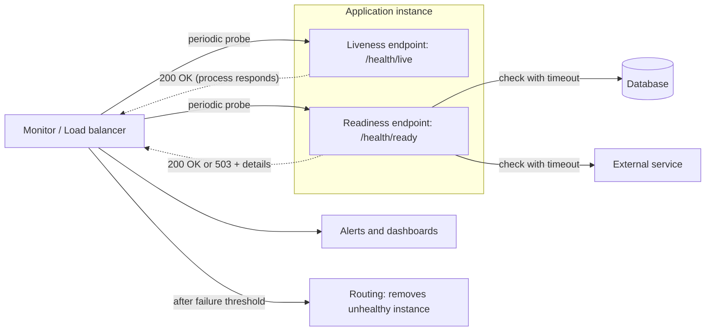

```mermaid
flowchart LR
    M["Monitor / Load balancer"]
    subgraph APP["Application instance"]
        L["Liveness endpoint: /health/live"]
        R["Readiness endpoint: /health/ready"]
    end
    D[("Database")]
    S["External service"]
    AL["Alerts and dashboards"]
    RT["Routing: removes unhealthy instance"]

    M -->|"periodic probe"| L
    M -->|"periodic probe"| R
    L -.->|"200 OK (process responds)"| M
    R -->|"check with timeout"| D
    R -->|"check with timeout"| S
    R -.->|"200 OK or 503 + details"| M
    M --> AL
    M -->|"after failure threshold"| RT
```
