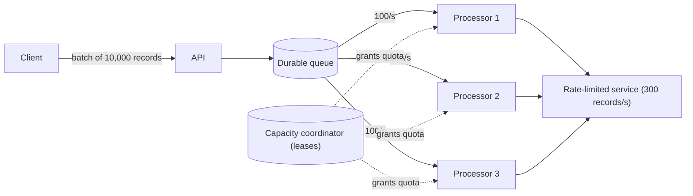

```mermaid
flowchart LR
    U[Client] -->|"batch of 10,000 records"| API[API]
    API --> Q[("Durable queue")]
    Q -->|"100/s"| P1[Processor 1]
    Q -->|"100/s"| P2[Processor 2]
    Q -->|"100/s"| P3[Processor 3]
    L[("Capacity coordinator (leases)")] -.->|"grants quota"| P1
    L -.->|"grants quota"| P2
    L -.->|"grants quota"| P3
    P1 --> S["Rate-limited service (300 records/s)"]
    P2 --> S
    P3 --> S
```
