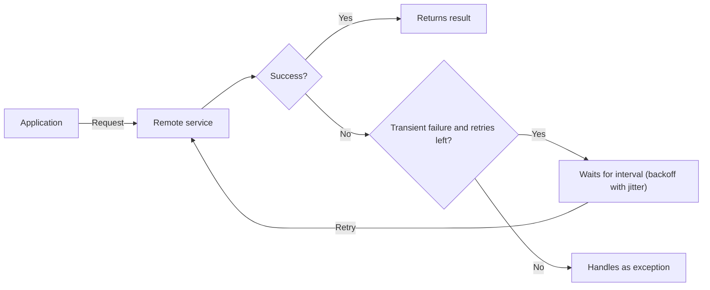

```mermaid
flowchart LR
    A["Application"] -->|"Request"| B["Remote service"]
    B --> C{"Success?"}
    C -->|"Yes"| D["Returns result"]
    C -->|"No"| E{"Transient failure and retries left?"}
    E -->|"Yes"| F["Waits for interval (backoff with jitter)"]
    F -->|"Retry"| B
    E -->|"No"| G["Handles as exception"]
```
