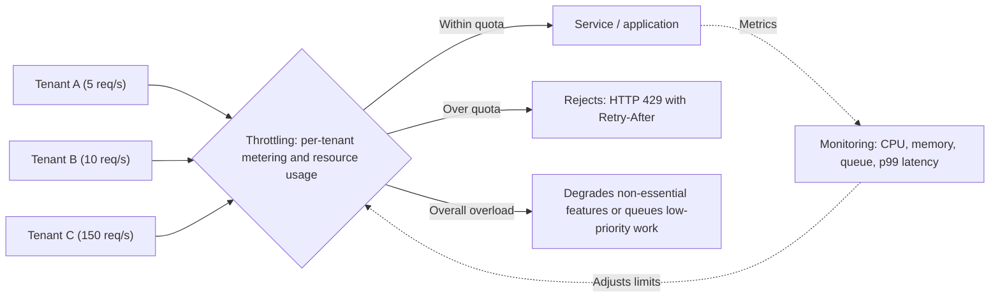

```mermaid
flowchart LR
    TA["Tenant A (5 req/s)"] --> T
    TB["Tenant B (10 req/s)"] --> T
    TC["Tenant C (150 req/s)"] --> T
    T{"Throttling: per-tenant metering and resource usage"}
    T -->|"Within quota"| S["Service / application"]
    T -->|"Over quota"| R["Rejects: HTTP 429 with Retry-After"]
    T -->|"Overall overload"| D["Degrades non-essential features or queues low-priority work"]
    M["Monitoring: CPU, memory, queue, p99 latency"] -.->|"Adjusts limits"| T
    S -.->|"Metrics"| M
```
