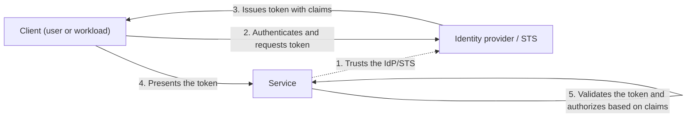

```mermaid
flowchart LR
    C["Client (user or workload)"]
    I["Identity provider / STS"]
    S["Service"]
    S -. "1. Trusts the IdP/STS" .-> I
    C -- "2. Authenticates and requests token" --> I
    I -- "3. Issues token with claims" --> C
    C -- "4. Presents the token" --> S
    S -- "5. Validates the token and authorizes based on claims" --> S
```
