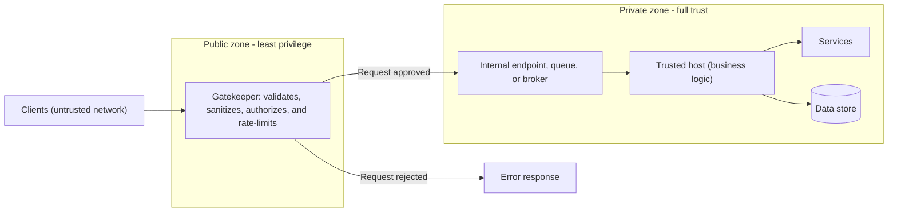

```mermaid
flowchart LR
    C["Clients (untrusted network)"] --> G
    subgraph Publico["Public zone - least privilege"]
        G["Gatekeeper: validates, sanitizes, authorizes, and rate-limits"]
    end
    G -- "Request rejected" --> X["Error response"]
    G -- "Request approved" --> Q["Internal endpoint, queue, or broker"]
    subgraph Privado["Private zone - full trust"]
        Q --> T["Trusted host (business logic)"]
        T --> S["Services"]
        T --> D[("Data store")]
    end
```
