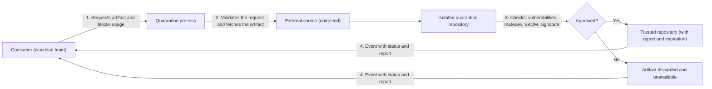

```mermaid
flowchart LR
    C["Consumer (workload team)"] -->|"1. Requests artifact and blocks usage"| Q[Quarantine process]
    Q -->|"2. Validates the request and fetches the artifact"| E["External source (untrusted)"]
    E --> R[Isolated quarantine repository]
    R -->|"3. Checks: vulnerabilities, malware, SBOM, signature"| V{Approved?}
    V -->|Yes| T["Trusted repository (with report and expiration)"]
    V -->|No| D[Artifact discarded and unavailable]
    T -->|"4. Event with status and report"| C
    D -->|"4. Event with status and report"| C
```
