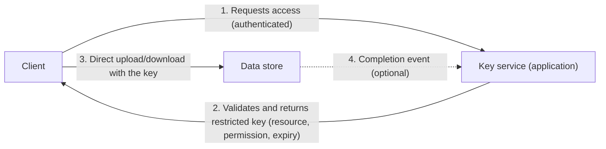

```mermaid
flowchart LR
    C["Client"]
    V["Key service (application)"]
    S["Data store"]
    C -->|"1. Requests access (authenticated)"| V
    V -->|"2. Validates and returns restricted key (resource, permission, expiry)"| C
    C -->|"3. Direct upload/download with the key"| S
    S -.->|"4. Completion event (optional)"| V
```
