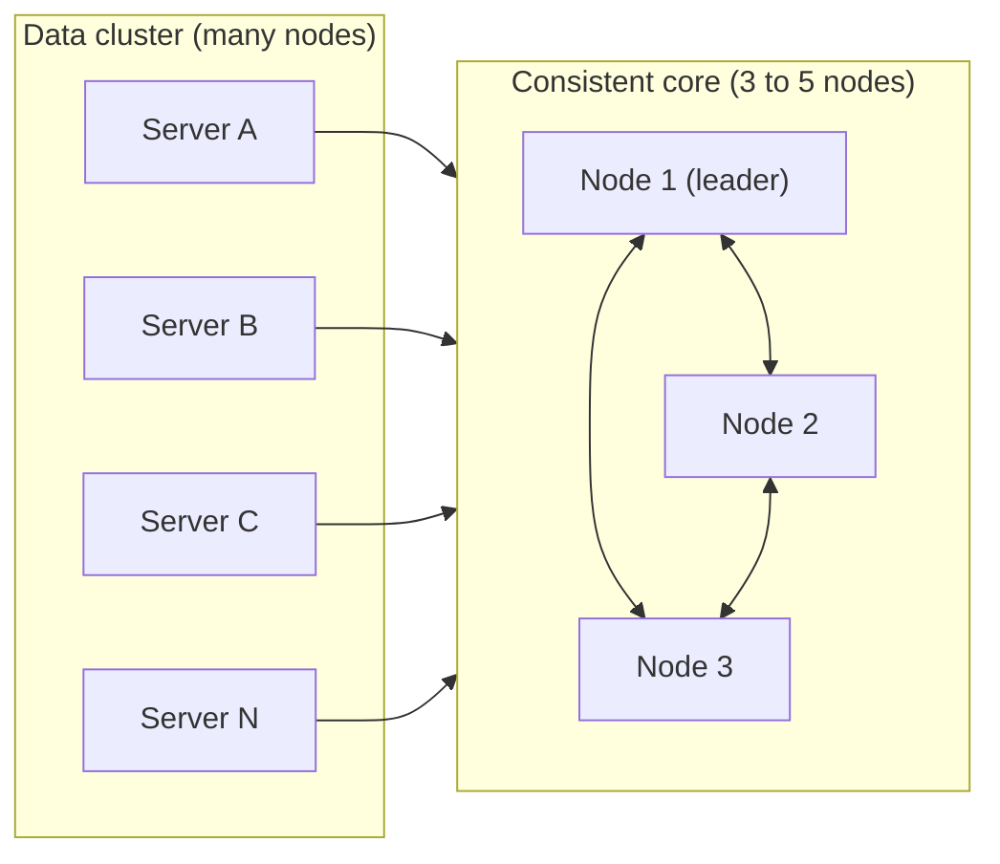

```mermaid
flowchart LR
    subgraph core["Consistent core (3 to 5 nodes)"]
        C1["Node 1 (leader)"]
        C2["Node 2"]
        C3["Node 3"]
        C1 <--> C2
        C1 <--> C3
        C2 <--> C3
    end
    subgraph data["Data cluster (many nodes)"]
        D1["Server A"]
        D2["Server B"]
        D3["Server C"]
        D4["Server N"]
    end
    D1 --> core
    D2 --> core
    D3 --> core
    D4 --> core
```
