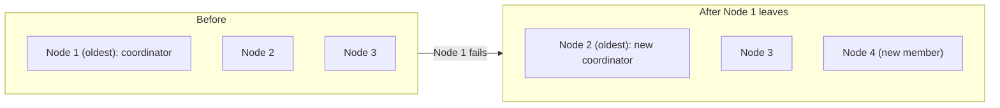

```mermaid
flowchart LR
    subgraph antes["Before"]
        A1["Node 1 (oldest): coordinator"]
        A2["Node 2"]
        A3["Node 3"]
    end
    subgraph depois["After Node 1 leaves"]
        B2["Node 2 (oldest): new coordinator"]
        B3["Node 3"]
        B4["Node 4 (new member)"]
    end
    antes -->|"Node 1 fails"| depois
```
