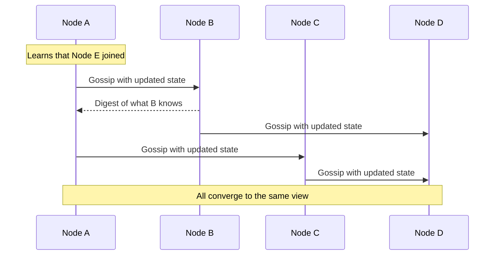

```mermaid
sequenceDiagram
    participant A as Node A
    participant B as Node B
    participant C as Node C
    participant D as Node D
    Note over A: Learns that Node E joined
    A->>B: Gossip with updated state
    B-->>A: Digest of what B knows
    B->>D: Gossip with updated state
    A->>C: Gossip with updated state
    C->>D: Gossip with updated state
    Note over A,D: All converge to the same view
```
