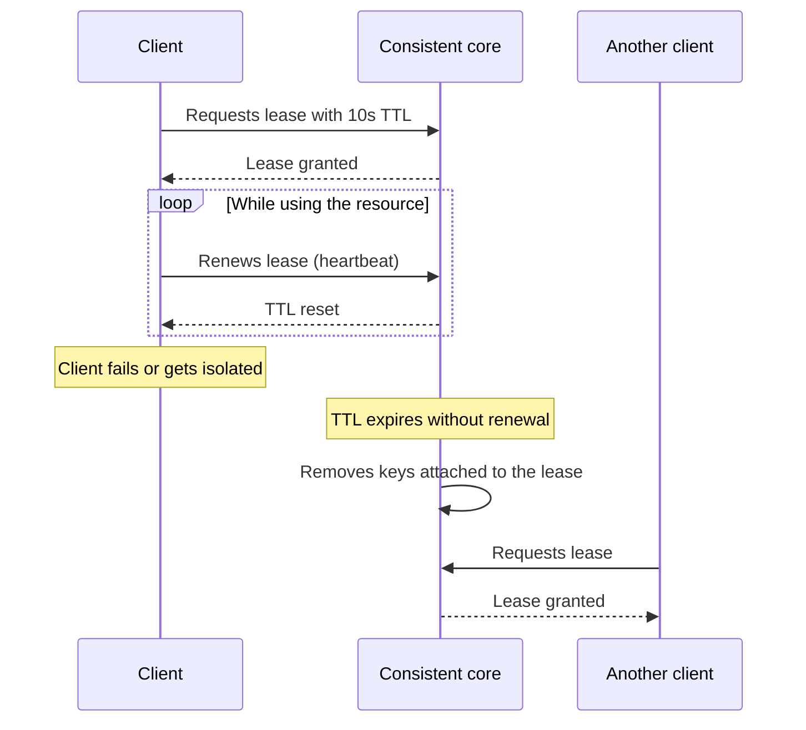

```mermaid
sequenceDiagram
    participant C as Client
    participant N as Consistent core
    participant O as Another client
    C->>N: Requests lease with 10s TTL
    N-->>C: Lease granted
    loop While using the resource
        C->>N: Renews lease (heartbeat)
        N-->>C: TTL reset
    end
    Note over C: Client fails or gets isolated
    Note over N: TTL expires without renewal
    N->>N: Removes keys attached to the lease
    O->>N: Requests lease
    N-->>O: Lease granted
```
