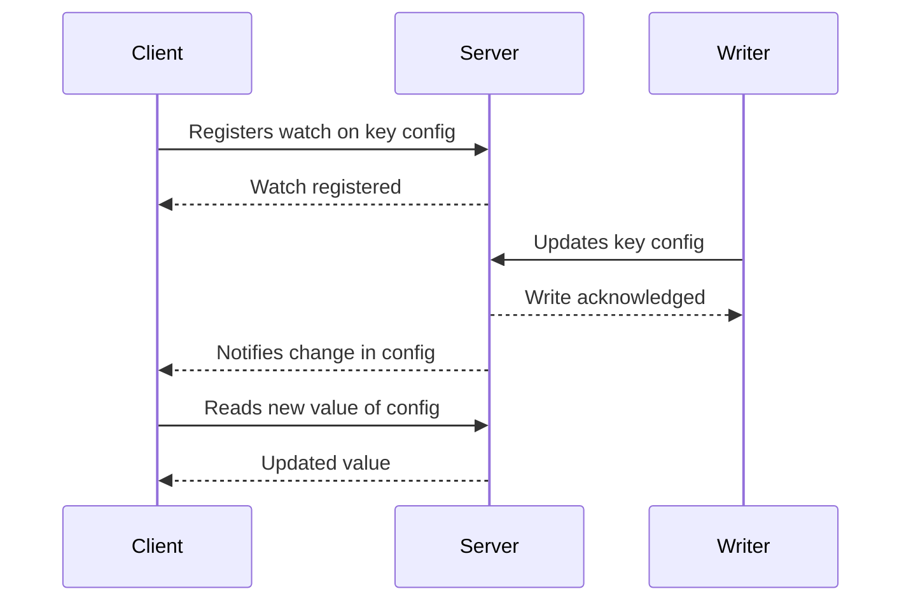

```mermaid
sequenceDiagram
    participant C as Client
    participant S as Server
    participant W as Writer
    C->>S: Registers watch on key config
    S-->>C: Watch registered
    W->>S: Updates key config
    S-->>W: Write acknowledged
    S-->>C: Notifies change in config
    C->>S: Reads new value of config
    S-->>C: Updated value
```
