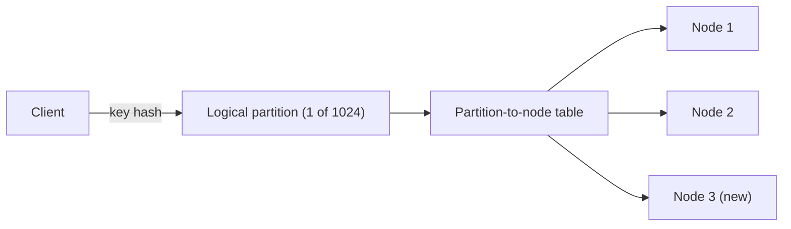

```mermaid
flowchart LR
    C["Client"] -->|"key hash"| P["Logical partition (1 of 1024)"]
    P --> T["Partition-to-node table"]
    T --> N1["Node 1"]
    T --> N2["Node 2"]
    T --> N3["Node 3 (new)"]
```
